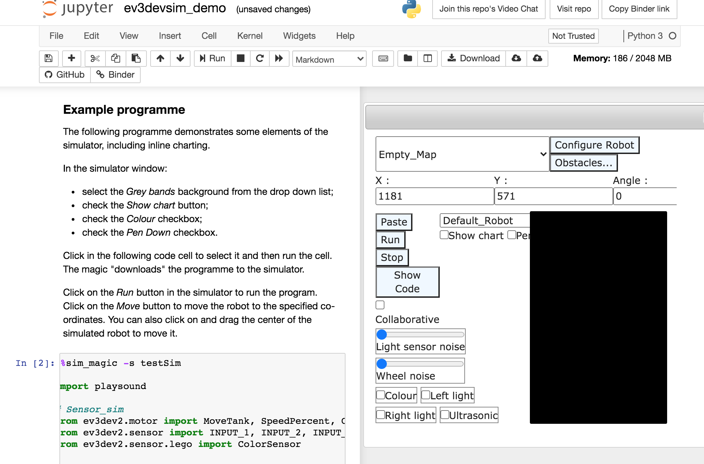

# nbev3devsim
`nbev3devsim` packages the [*Ev3DevSim*](https://github.com/QuirkyCort/ev3dev-sim) simulator as an `ipywidget` for use in Jupyter notebooks.

Click the Binder button to launch a demo:

### About `ev3devsim`

`ev3devsim` is a "browser based simulator for ev3dev-lang-python" [[repo](https://github.com/QuirkyCort/ev3dev-sim), [demo](https://www.aposteriori.com.sg/Ev3devSim/index.html)]. The original demostration provides a browser based terminal for writing ev3dev-lang-pyhton code that is then executed in a Javascript based Skulpt Python environment and used to control a simulated robot via a simple 2D simulator implemented using Javascript and HTML canvas elements.

### Related blog posts:

- [Simple 2D ev3devsim Javascript Simulator Running as an ipywidget in Jupyter Notebooks](https://blog.ouseful.info/2020/03/13/simple-2d-ev3devsim-javascript-similator-running-as-an-ipywidget-in-jupyter-notebooks/)
- (ish!) [Simple Text to Speech With Skulpt](https://blog.ouseful.info/2020/02/26/simple-text-to-speech-with-skulpt/)
